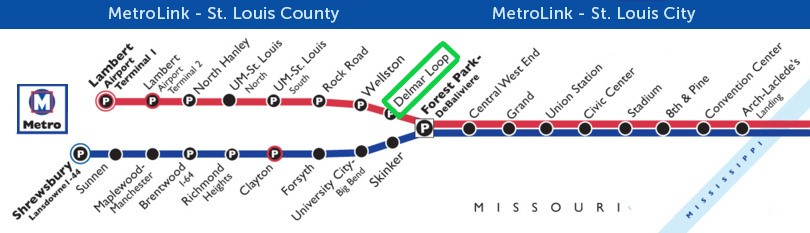

----

## Arrival

The Washington University campus is about 20 minutes by car from [St Louis Lambert International Airport](https://www.google.com/maps/place/St.+Louis+Lambert+International+Airport/@38.7394275,-90.3817249,13z/data=!4m12!1m6!3m5!1s0x87df36b4c56388f1:0x9dabcdbc663077a6!2sSt.+Louis+Lambert+International+Airport!8m2!3d38.7503222!4d-90.3754521!3m4!1s0x87df36b4c56388f1:0x9dabcdbc663077a6!8m2!3d38.7503222!4d-90.3754521) is a focus city for Southwest Airlines, which has a dedicated terminal. All other airlines are based in Terminal 1, which has an iconic copper roof. Rental cars are available, most of which require a shuttle to a nearby location. When mapping your drive to or from the airport to your hotel/dorm, be sure to select the appropriate terminal.
 

### Metrolink

The St. Louis Metrolink departs Lambert Airport every 20 minutes and offers an efficient alternative to taxis.

If arriving in terminal 1, use this  [guide](http://georaman2014.wustl.edu/lambert-term1.jpg) to travel by train to the hotel.

From [terminal 2](http://georaman2014.wustl.edu/lambert-term2.jpg).

Exit the train at the highlighted stop, Delmar Loop:

### Car Services
Taxis and [Uber](https://get.uber.com/?utm_source=AdWords_Brand&utm_campaign=search-google-brand_1_-99_us-midmarket_d_txt_acq_cpc_en-us_uber_kwd-294953166390_220914064269_40469214925_e_c_track-jan22urlupdate-sl42391-1114_restructure&cid=813647711&adg_id=40469214925&fi_id=5028672018&match=e&net=g&dev=c&dev_m=&cre=220914064269&kwid=kwd-294953166390&kw=uber&placement=&tar=&gclid=EAIaIQobChMIy6-d2oeJ2gIVki-BCh0X9Ap4EAAYASABEgKYk_D_BwE&gclsrc=aw.ds&dclid=CO6kgd2HidoCFZvI4wcdqy4BOg) are available at the appropriate exits.

Terminal 1: Exit Door 14 to Garage Yellow level.

Terminal 2: Exit Door 12

----

## Accommodations

### Hotel

All collaborators will be staying at the [Moonrise Hotel](https://moonrisehotel.com/the-hotel/) on the bustling Delmar Loop. The hotel is just minutes away from the Metrolink and a a mile away from [Washington University in St. Louis](https://wustl.edu/wp-content/uploads/2017/06/Danforth-Campus-Map-2017.pdf) (D4 106)

[Directions](https://www.google.com/maps/dir/Moonrise+Hotel,+6177+Delmar+Blvd,+St.+Louis,+MO+63112/Washington+University+in+St.+Louis,+1+Brookings+Dr,+St.+Louis,+MO+63130/@38.6521492,-90.3091507,16z/data=!3m1!4b1!4m14!4m13!1m5!1m1!1s0x87df4aaa6155fc13:0x1c89cb4a47d03dc9!2m2!1d-90.2987076!2d38.6555695!1m5!1m1!1s0x87d8b5460f9c0fcf:0x94fa9481183c7669!2m2!1d-90.3107962!2d38.6487895!3e2)

---- 

## Local food & attractions

Saint Louis has a vibrant and diverse community which offers a wide variety of food and entertainment. You will be staying on Delmar Loop, one of the most popular neighborhoods for food and drink. Additionally, the nearby Forest Park is a great destination to get a quick view of the local culture.

### Food

- [Eclipse Restaurant](https://moonrisehotel.com/dining-at-the-moonrise-hotel/) (Dining at Moonrise)
- [Fork & Stix](http://forknstix.com/)
- [U-City Grill](https://www.riverfronttimes.com/stlouis/u-city-grill/Location?oid=2688527)
- [Salt + Smoke](http://saltandsmokestl.com/menu/)

 

### Entertainment

- [Flamingo Bowl](http://flamingobowl.com/)
- [St. Louis Zoo](https://www.stlzoo.org/) (Free Admission)
- [St. Louis Art Museum](http://www.slam.org/)
- [Forest Park](https://forestparkmap.org/)

